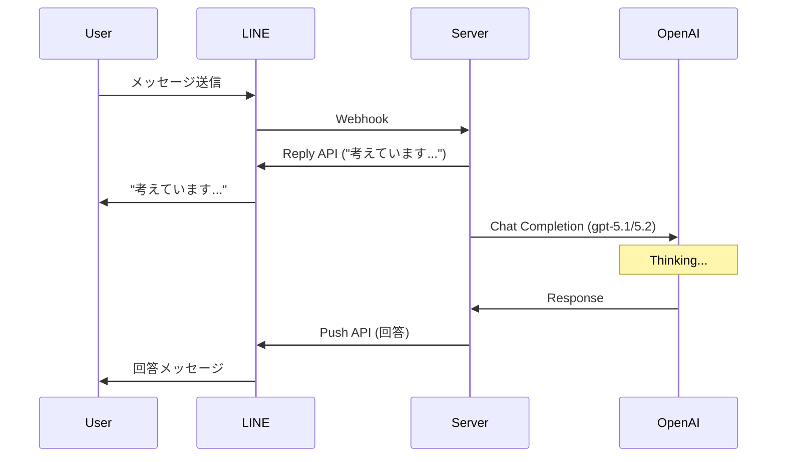

# コンサルタント特化型プラン (Consultant Focus Plan) アーキテクチャ設計書

## 1. 概要
「コンサルタント特化型プラン」は、既存の店舗向けBotとは異なり、膨大なナレッジ（100万文字クラス）を背景に、高度な推論モデルを用いてユーザーの複雑な相談に応答するシステムです。

## 2. 推論モデル (Thinking Models) 対応アーキテクチャ

### 課題
- **OpenAI gpt-5.1 / gpt-5.2** などの推論強化モデルは、複雑な推論を行う場合に回答生成に時間がかかる可能性がある（従来の即時応答より遅延が大きい）。
- LINE Messaging API の Webhook タイムアウト（数秒〜10秒程度で再送が発生）により、単純な同期処理ではタイムアウトエラーや重複応答が発生する。

### 提案ソリューション: "Immediate Reply + Push Notification" パターン

1. **Webhook 受信時**:
   - ユーザーからのメッセージを受け取ったら、即座に **「Reply API」** を使用してローディングメッセージ（例: 「🧠 専門知識を元に深く考えています... 少々お待ちください。」）を返す。
   - これにより、LINE側のタイムアウトを回避し、ユーザーに処理中であることを伝える。

2. **非同期推論処理**:
   - `waitUntil` (Vercel/Cloudflare Workers等の場合) または Next.js の `after` (実験的機能) 、あるいは単純にレスポンス返却後の非同期タスクとして、OpenAI API を呼び出す。
   - モデルが `gpt-5.1` / `gpt-5.2` 等の推論強化モデルの場合、思考プロセスに時間がかかることを前提に設計する。

3. **回答の送信**:
   - 推論完了後、**「Push API」** を使用して最終的な回答を送信する。
   - コストへの配慮: Push API は送信数課金があるため、コンサルタントプラン（高単価プラン）専用機能とする。

### シーケンス図


## 3. 大規模ナレッジ・インポート機能 (File Import)

### 対応フォーマット
- **PDF**: `pdf-parse` 等を使用し、テキストレイヤーを抽出。
- **Word (.docx)**: `mammoth` 等を使用し、生テキストを抽出。
- **CSV**: Q&A形式やリストデータの取り込みに対応。

### 処理パイプライン
1. **Upload**: 管理画面からファイルをアップロード (Server Action `uploadKnowledgeFile`)。
2. **Extraction**: サーバーサイドでテキスト抽出。
3. **Chunking**:
   - 100万文字クラスの場合、単純な改行分割では文脈が途切れる。
   - **Recursive Character Text Splitter** (LangChainのアルゴリズム的なもの) を実装し、重要ヘッダーや段落単位で意味のある塊（チャンク）を作成する。
   - チャンクサイズ目安: 500〜1000トークン (o1等のコンテキストウィンドウを活かすため、少し大きめでも可)。
4. **Embedding**: `text-embedding-3-small` (または `large`) でベクトル化。
5. **Storage**: Supabase `knowledge_base` テーブルに保存。

## 4. 検索精度強化 (Hybrid Search + Reranking)

### 現状の問題点
- 単純な Cosine Similarity 検索だけでは、ユーザーが特定の専門用語（キーワード）を使った際に、ベクトルが近い「一般的な概念」がヒットしてしまい、精緻な正解文書が埋もれる。

### 提案ソリューション: Hybrid Search (RRF)
PostgreSQL の Full Text Search (BM25相当) と Vector Search を組み合わせ、**Reciprocal Rank Fusion (RRF)** で再順位付けを行う。

#### SQL実装イメージ (RPC)
```sql
create or replace function match_knowledge_hybrid (
  query_text text,
  query_embedding vector(1536),
  match_threshold float,
  match_count int,
  p_tenant_id uuid
)
returns setof knowledge_base
language plpgsql
as $$
begin
  return query
  with vector_search as (
    select id, rank() over (order by embedding <=> query_embedding) as rank_vec
    from knowledge_base
    where tenant_id = p_tenant_id
    order by embedding <=> query_embedding limit match_count * 2
  ),
  keyword_search as (
    select id, rank() over (order by ts_rank_cd(to_tsvector('japanese', content), plainto_tsquery('japanese', query_text)) desc) as rank_kw
    from knowledge_base
    where tenant_id = p_tenant_id
    and to_tsvector('japanese', content) @@ plainto_tsquery('japanese', query_text)
    limit match_count * 2
  )
  select kb.*
  from knowledge_base kb
  join (
    select coalesce(v.id, k.id) as id,
           coalesce(1.0 / (60 + v.rank_vec), 0.0) + coalesce(1.0 / (60 + k.rank_kw), 0.0) as rrf_score
    from vector_search v
    full outer join keyword_search k on v.id = k.id
  ) scores on kb.id = scores.id
  order by scores.rrf_score desc
  limit match_count;
end;
$$;
```

これにより、「キーワードの一致」と「意味の近さ」をバランスよく評価できる。

## 5. 実装ロードマップ

1. **Phase 1: Database & Backend**
   - Supabase RPC (`match_knowledge_hybrid`) の追加。
   - ファイルアップロード用ライブラリ (`pdf-parse`, `mammoth`) の追加。
   - Server Actions の機能拡充 (`importKnowledgeFromFile`)。

2. **Phase 2: Logic Update**
   - LINE Bot (`route.ts`) の改修。
   - モデル判定ロジックと「Reply + Push」フローの実装。
   - Hybrid Search への切り替え。

3. **Phase 3: UI Update**
   - 管理画面 (`admin/page.tsx`) にファイルアップローダー UI コンポーネントを追加。
